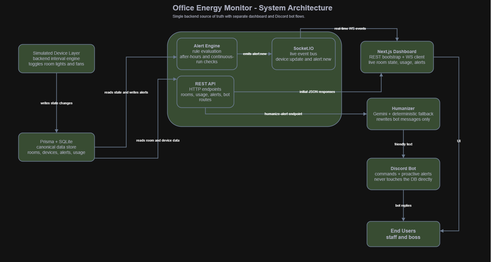

# Techathon Nationals 2026 - FormulaOne

This repository is the public source code for our full solution: backend API, live dashboard, Discord bot, architecture docs, and hardware/system diagrams. Everything needed to review, set up, run, and demo the project is included here.

## Problem
Office lights and fans are easy to leave running after people leave, and nobody has a single place to check what is still on. That means wasted power, avoidable bills, and no quick way for the boss or staff to spot problems. We built a shared live monitoring system that tracks office devices, shows the current state on a dashboard, and answers the same questions from Discord. It also detects suspicious patterns like after-hours usage and rooms that have been fully powered for too long.

## What We Built
- A shared backend that stores live room, device, usage, and alert state.
- A real-time Next.js dashboard with KPI cards, device status, power usage, alerts, and an animated office floor plan.
- A Discord bot with `!status`, `!room <name>`, and `!usage` commands.
- An alert engine for after-hours usage and continuous full-room power usage.
- An AI response layer with deterministic fallback so device logic never depends on model availability.

## Repository Layout
- `apps/backend`: Express + Socket.IO backend, simulator, Prisma, and alert engine
- `apps/web`: Next.js dashboard
- `apps/bot`: Discord bot
- `packages/shared-types`: Shared TypeScript contracts
- `docs`: Demo script, API contract, deployment notes, and all project diagrams

## Architecture


Architecture summary: the simulated device layer runs inside the backend and updates device state in SQLite through Prisma. The same backend serves REST data to the dashboard and Discord bot, emits live Socket.IO events to the dashboard, and runs the alert engine that creates and resolves alerts from current device state.

## Hardware Concept


The hardware demo models one representative room with an ESP32, relay-driven fans, LED light stand-ins, and an optional ACS712 current sensor. The same pattern extends to the full office layout of 3 rooms.

## Tech Stack
- Backend: Node.js, TypeScript, Express, Socket.IO, Prisma, SQLite, Zod, Vitest
- Web dashboard: Next.js 14 App Router, TypeScript, Tailwind CSS, Framer Motion, Recharts, lucide-react
- Discord bot: discord.js, TypeScript, Axios, Socket.IO client

## Prerequisites
- Node.js 20+ recommended
- npm 10+ recommended
- A Discord application and bot token if you want to run the bot

## Environment Setup
Copy each example file and fill in the values:

```bash
cp apps/backend/.env.example apps/backend/.env
cp apps/web/.env.example apps/web/.env
cp apps/bot/.env.example apps/bot/.env
```

Required values:

### Backend (`apps/backend/.env`)
- `PORT=4000`
- `WEB_ORIGIN=http://localhost:3000`
- `DATABASE_URL="file:../dev.db"`
- `BOT_API_KEY=...`
- `GEMINI_API_KEY=` optional; leave blank for deterministic fallback replies
- `SIMULATION_INTERVAL_MS=15000`

### Web (`apps/web/.env`)
- `NEXT_PUBLIC_BACKEND_URL=http://localhost:4000`

### Bot (`apps/bot/.env`)
- `DISCORD_BOT_TOKEN=...`
- `BACKEND_URL=http://localhost:4000`
- `BOT_API_KEY=...` and it must match the backend value
- `ALERT_CHANNEL_ID=...` optional depending on your Discord setup

## Install Dependencies

```bash
npm install
```

## Initialize The Database
Run these commands once after installing dependencies:

```bash
npx prisma generate -w apps/backend
npm run db:init -w apps/backend
npm run db:seed -w apps/backend
```

What each command does:
- `npx prisma generate -w apps/backend`
  Generates the Prisma client required by the backend scripts and API.
- `npm run db:init -w apps/backend`
  Runs `apps/backend/src/scripts/bootstrapDb.ts`, which loads `apps/backend/prisma/migrations/202607031915_init/migration.sql` and creates the SQLite schema.
- `npm run db:seed -w apps/backend`
  Runs `apps/backend/prisma/seed.ts`, which inserts the representative office dummy data into the database.

What the seed script creates:
- 3 rooms: `drawing`, `work1`, `work2`
- 15 devices total
- 2 fans per room at `60W` each
- 3 lights per room at `15W` each
- all devices start as `off`
- every device receives an initial `lastChangedAt` timestamp

Important judge note:
- The generated SQLite file `apps/backend/dev.db` is local runtime data and does not need to be committed.
- The reproducible setup is the committed code in `apps/backend/src/scripts/bootstrapDb.ts` and `apps/backend/prisma/seed.ts`.
- A judge can recreate the same dataset locally by running the three commands above.

Expected seed result:

```text
Seeded 3 rooms, 15 devices, 6 fans, 9 lights.
```

After this step, the backend simulator mutates that seeded data over time, so the dashboard and bot always have live-changing values to display.

## Dummy Data And DB Scripts

### Dummy data generator / seed script
- File: `apps/backend/prisma/seed.ts`
- Purpose: inserts the initial office dataset used by the dashboard and Discord bot
- Behavior:
  - upserts all 3 rooms
  - upserts 2 fans and 3 lights for each room
  - assigns fixed wattages used by the live power calculations
  - resets device status to `off` on each seed run so the demo starts from a known state

### DB init / bootstrap script
- File: `apps/backend/src/scripts/bootstrapDb.ts`
- Purpose: creates the database schema from the checked-in SQL migration
- Behavior:
  - reads `apps/backend/prisma/migrations/202607031915_init/migration.sql`
  - executes the SQL statements against the SQLite database from `DATABASE_URL`
  - prints `Database schema initialized.` on success

### Why this matters for judges
- Judges do not need your local `dev.db` file.
- Judges do need the committed bootstrap script, seed script, and setup instructions so they can reproduce the exact demo dataset themselves.
- This repository includes all three, so the data setup is reviewable and repeatable.

## Run The Full Project

### Option A: Start everything together

```bash
npm run dev
```

This starts:
- backend on `http://localhost:4000`
- dashboard on `http://localhost:3000`
- Discord bot in watch mode

### Option B: Start each service separately

```bash
npm run dev:backend
npm run dev:web
npm run dev:bot
```

## How To Use The Project

### Backend
- Provides REST endpoints for rooms, usage, and alerts
- Emits live Socket.IO device updates for the dashboard
- Runs the simulator and alert engine

### Dashboard
- Open `http://localhost:3000`
- View KPI cards, device status, alerts, charts, and the animated floor plan
- Device state should update live without a page refresh

### Discord Bot
- Invite the bot to your server
- Enable the **Message Content Intent** in the Discord Developer Portal
- Available commands:
  - `!status`
  - `!room drawing`
  - `!room work1`
  - `!room work2`
  - `!usage`

## Suggested Verification Flow
1. Start the backend and confirm it boots without Prisma errors.
2. Open the dashboard and confirm room/device data appears.
3. Wait for simulated device changes and verify the UI updates live.
4. Run bot commands in Discord and confirm they reflect current backend state.
5. Check that alerts appear for simulated after-hours or long-running conditions.

## Live Demo Links
- Dashboard URL: `TBD`
- Discord bot access note: invite the deployed bot to the judging server and share the command list there

## AI / Model Attribution
The AI phrasing layer uses Google's Gemini (`gemini-2.0-flash`). It is used only to rewrite already-computed facts into friendlier wording. Device state, power logic, alert rules, and system decisions are deterministic and still work when the AI layer is unavailable. Set `GEMINI_API_KEY` to enable it; without a key the bot serves deterministic fallback text.

## Team
- Team name: `FormulaOne`
- MD Jahid Hasan Jim
  GitHub: https://github.com/jim2107054
- Sheikh Md. Galib Mahim
  GitHub: https://github.com/SheikhGalib
- Arka Braja Prasad Nath
  GitHub: https://github.com/AriyaArKa

